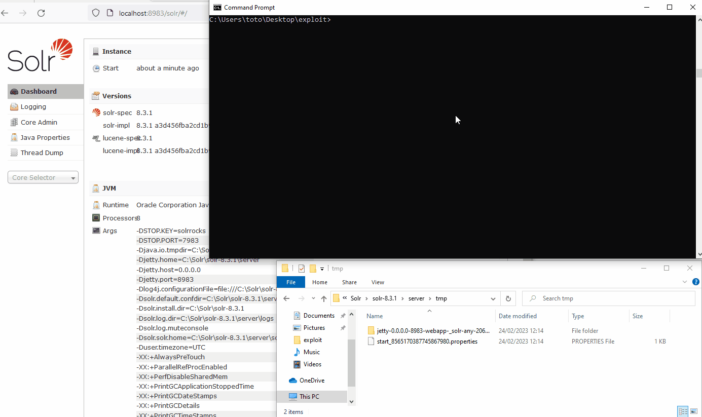

# Apache Solr 8.3.1 admin panel RCE (Windows)

### Description:
This exploit allows code execution without any prior authentication on a default Solr admin panel.

### Authors:
   - Nicolas Brunner - SCRT
   
### Writeup
[https://blog.scrt.ch](https://blog.scrt.ch)

### PoC:


### Examples:

##### If no core exists, create the core from the default folder:
```bash
./exploit.py -u http://example.com/solr --default-core -c core_123
```
##### Using the existing core named core_123, create a new vulnerable core and execute calc.exe:
```bash
./exploit.py -u http://example.com/solr -f calc.xml -c core_123
```

### Installation:

##### Installation of the required python libraries
```bash
pip3 install -r requirements.txt
```